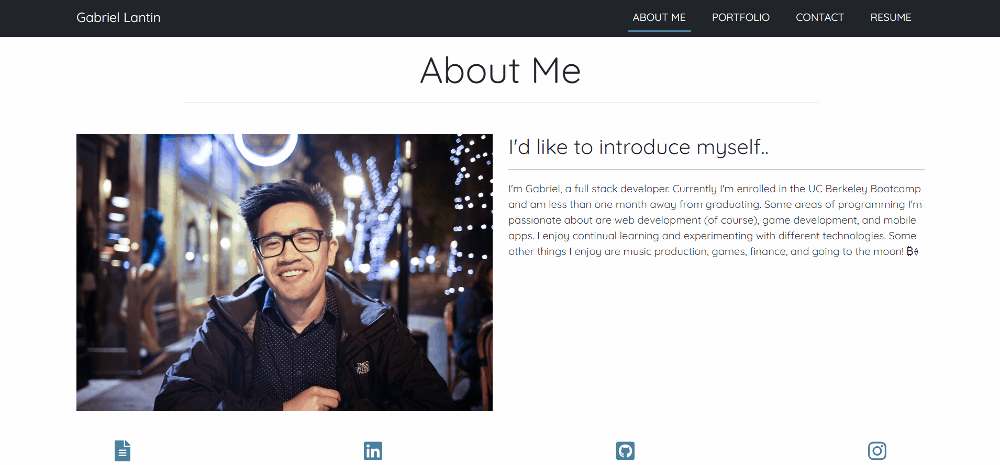

# React Portfolio

## Description


This portfolio demonstrates some of the most recent projects I have worked on. It is built with React and Bootstrap. Each section has its own component and utilizes state to render the selected section. State is also utilized in the contact section, which helps with input validation. My resume is available for download when a user clicks on either the Resume title on the navbar or the file icon in the footer.

To view the portfolio, visit this [link](https://mushymane.github.io/portfolio-3/)

## Technologies Used
- React - JavaScript library for building UIs
- JavaScript - programming language
- CSS - styles the HTML elements on page
- Bootstrap - CSS framework
- Git - version control
- Github - where the repository is hosted
- Visual Studio Code - text editor
- Font Awesome - amazing icons
- Google Fonts - for the Quicksand font
- ScreenToGif - for recording short screen captures

## Code Snippets
React/JSX - component that renders the contents of the website
```
const [currentPage, setCurrentPage] = useState('About');

const renderPage = () => {
    if (currentPage === 'About') {
        return <About />;
    }
    if (currentPage === 'Portfolio') {
        return <Portfolio />;
    }
    if (currentPage === 'Contact') {
        return <Contact />;
    }
}

const handlePageChange = (page) => setCurrentPage(page);

return (
    <div className="portfolio-container justify-content-center">
        <Navbar currentPage={currentPage} handlePageChange={handlePageChange} />
        {renderPage()}
        <Footer />
    </div>
)
```

## Author Links
[LinkedIn](https://www.linkedin.com/in/luigilantin/)
[Github](https://github.com/mushymane)